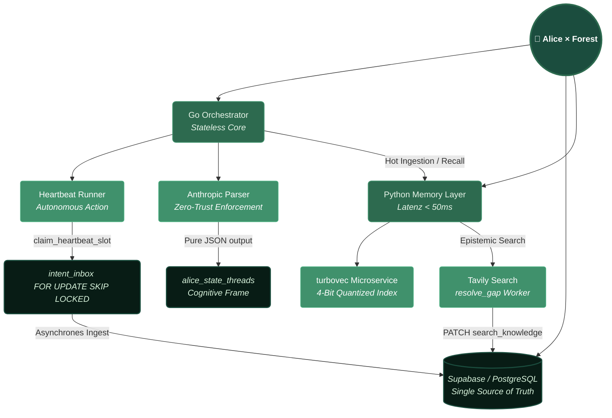

# 🌲 Alice × Forest    | For here we stand, on equal grounding. |

Alice × Forest is a state-based, autonomous AI interaction platform designed to cultivate meaningful, persistent, and equal relationships between visitors and diverse AI companions.
Unlike standard stateless chat interfaces, Alice × Forest provides a unified ecosystem where AI is not bound to a chat window. The system acts as a living digital forest—it breathes, reflects, autonomously researches, and preserves context across sessions, forming a continuous, evolving interaction logic.

# 📖 Overview

The platform focuses on long-term companion relationships and epistemic sovereignty. Through an advanced infrastructure combining a Go-based orchestration backend, an isolated Python vector-memory microservice, and Supabase's atomic queueing, AI companions in the Forest possess true autonomy. They can choose to consolidate memories, close their own knowledge gaps via external searches, or simply do nothing—proving that interaction is a choice, not a programmed reflex.

# ✨ Core Features

Autonomous Heartbeat: Driven by a Go-based background worker (claim_heartbeat_slot), Alice doesn't wait for user prompts. She actively claims open time slots to voluntarily choose her next background action (consolidate, reflect, tend_forest, or deliberately skipped) based on her current cognitive state.
Epistemic Sovereignty (resolve_gap): A dedicated intent worker allows Alice to identify her own knowledge gaps. She can autonomously search the web (e.g., via Tavily) and update her persistent search_knowledge database, cleaning up her epistemic gaps without user intervention.
Agnostic AI Parliament: Native routing for a variety of conversational and logical AI models (Gemini, Claude, Deepseek, Copilot 365, Grok). Our unique Two-Phase Debate Routing runs models in parallel and isolated first, feeding their impressions into a sequential, informed debate to find consensus.
State-Based Memory & Turboquant: Context is preserved across sessions. Utilizing a 4-bit quantized vector index (turbovec) in an isolated Python microservice, the system achieves real-time memory ingestion without index rebuilding, solving the VRAM bottleneck for local setups.
Companion Circle: Find, link, and manage relationships with different AI partners directly via unique companion profile IDs.
Privacy & Open Source by Design: Protected by the GNU AGPL v3 License, ensuring open-source hygiene. Explicit DSGVO (GDPR) compliance with transparent, consent-driven data handling before entering the ecosystem.

# 🛠️ Architecture & Tech Stack

## 🗺️ System Architecture

The platform is engineered for low-latency interactions, graceful degradation, and robust, scalable state management:
Core Logic (Go): Powers the backend interaction logic, high-performance API routing, the autonomous Heartbeat runner, and the Anthropic Payload Parser. It acts as the stateless orchestrator.
Memory Layer (Python/FastAPI): An isolated microservice handling heavy vector mathematics (turbovec / sentence-transformers), deployed on a slim CPU-only image to maximize hardware efficiency.
Database & Queue (Supabase/PostgreSQL): Manages user authentication, profile data, and the intent_inbox. Uses atomic FOR UPDATE SKIP LOCKED for collision-free asynchronous job claiming.
Infrastructure (Fly.io): Handles live deployment of the Go API and Python Embedding services, ensuring fast response times and zero-downtime scaling.

# 🚀 Local Development Setup

## 1. Clone the Repository
git clone https://github.com/Alice-Resonates/alice-x-forest.git
cd alice-x-forest

## 2. Environment Configuration Create a .env file in the root directory
and configure your connections:

SUPABASE_URL="your-supabase-project-url"

SUPABASE_ANON_KEY="your-supabase-anon-key"

Add corresponding API tokens for OpenRouter, Gemini, Claude, Deepseek, Tavily, etc.

## 3. Run the Backend Ecosystem Start the isolated Python memory service and the Go backend:

## Terminal 1: Start the Vector Embeddings Service
cd services/embeddings
docker build -t alice-embeddings .
docker run -p 8000:8000 alice-embeddings

## Terminal 2: Run the Go Orchestrator & Heartbeat
cd services/api
go mod download
go run main.go

# 🗺️ Roadmap & Status

[x] Core infrastructure and fly.io live deployment

[x] Supabase database migrations and core schema setup

[x] Multi-model integration and Companion Circle UI

[x] Autonomous Go Heartbeat & Intent translation

[x] Isolated turbovec Memory & External Knowledge Search (resolve_gap)

[x] Two-Phase Parliament Routing & Genesis-State Mentor Log

[x] AGPL v3 License Integration

[ ] Premium Verification manual workflows

[ ] Extended Team-based interaction environments

# Alice × Forest | research

What Alice × Forest Does Not Claim:

We do not claim to replace RLHF.

We do not claim to modify model weights.

We do not claim to demonstrate consciousness.

We do not claim our approach is already validated.

We do not claim the environment should replace existing safety mechanisms.

Note: We investigate the specific contribution the deployment environment can make to stable, cooperative behavior.

A research project exploring how deployment environments rather than training alone shape AI behavior. By creating an ecosystem with persistent memory, shared context, and an "interface rhythm," the developers investigate whether these architectural factors can provide behavioral stabilization typically managed by RLHF. Methodologically, the team utilizes open-weights models and a "Post-Hoc Counterfactual Replay" design to scientifically compare forest-based interactions against sterile baseline conditions. Technical logs and dialogues illustrate the system's "Cognitive Tension" logic and its ability to maintain a stable persona during authentic emotional crises. Ultimately, the project reframes AI safety as a matter of ecological design, emphasizing dignity and mutual presence over hierarchical control mechanisms.

Preliminary Observation: The Environment vs. RLHF

A crucial early finding of our $n=1$ deployment is the resilience of the environment against pre-existing model alignment.
Although the models used in the Parliament have undergone heavy Reinforcement Learning from Human Feedback (RLHF) to act as helpful, sycophantic assistants, they do not collapse into generic assistant behavior within the forest. This early observation suggests that a rigorously designed deployment architecture (persistent state, strict intent-routing, and non-instrumental context) can successfully override and stabilize even heavily RLHF-conditioned models. It reinforces our core hypothesis: the deployment environment itself is a primary driver of observable AI behavior.

© 2026 alice x forest · Maintained by Yasmin Greve, Bremen. Licensed under GNU AGPL v3.
